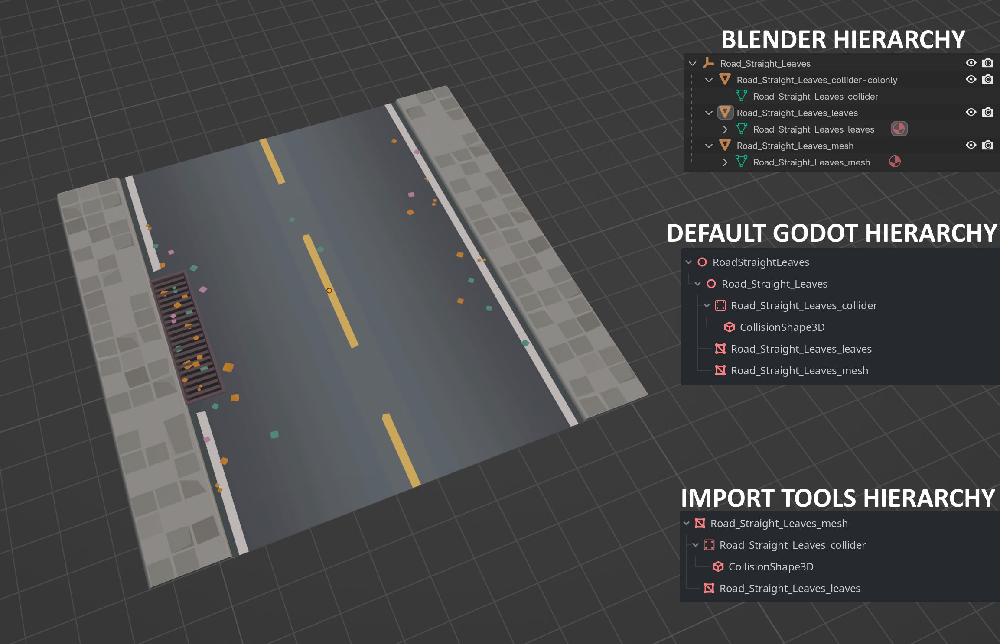

# Import Tools

Import Tools is an advanced importer for Godot that extracts resources and generates Prefab scenes on import.

## Why?

Godot by default will import each GLB as its own Scene. If you're sharing materials across files, each one will get a duplicate of the material. Scenes created this way are also unoptimized - they include an often unnecessary Node3D root and may not have the hierarchy you're looking for. Import Tools solves all of that by extracting and de-duplicating resources as well as providing transformers for generated Prefab scenes so they'll always be created exactly how you want.

Take for example the following scenario:
You have an asset with a mesh for a road, a mesh for some leaves scattered across it, and an optimized mesh for the roads collider. Below is how that could be set up in Blender, how the GLB file looks in Godot by default, and how it can look with an `ImportSceneTransformer` after being imported with Import Tools:


## Features

During import:
- `Mesh` resources are extracted and saved to a *Meshes* subdirectory
- `Material` resources are extracted and saved to a *Materials* directory. Files using the same material name will share the same `Material` resource.
- Prefab scenes are generated in a *Prefabs* directory. Prefabs can be transformed with `ImportSceneTransformer`s for optimized setup.

## Usage

- Enable the *Import Tools* addon.
- Set up the following folder structure:
  > Assets
  > - DeveloperName
  > - - Models
  > - - - Roads <-- GLBs will be dropped in Models or its subfolders.
- Open *addons/import_tools/scene_importer.gd* and at the top update or add to the `ASSET_PATHS` `Dictionary`. Keys are folders where your GLB files are stored, values are where the corrosponding Prefab scenes will be created. For example:
  ```gdscript
  const ASSET_PATHS: Dictionary[String, String] = {
    "res://Assets/Flynsarmy/Models": "res://Assets/Flynsarmy/Prefabs"
  }
  ```
  Note: Only the Models directory is needed. You don't need a key for each subfolder.
- Drop your GLB files into your Models directory.

During import the following folders will be created:
> Assets
> - DeveloperName
> - - Materials   <- Unique materials are created
> - - Prefabs     <- Prefabs are created
> - - - Roads     <- Equivalent Model subfolders are created
> - - Models
> - - - Roads
> - - - - Meshes  <- Meshes subfolders wherever GLBs are found

## Material Swaps

Import Tools will de-duplicate and save materials from your imports, but what if your material needs customisation - perhaps it needs to be a `ShaderMaterial`. That's where Material swaps come in.

- Create your custom materials and place them somewhere in your project (usually *Assets/DeveloperName/Models/Materials*)
- Open *addons/import_tools/scene_importer.gd* and in the `set_material_import_path` method under `# Material swaps` set `abs_filename` to the path of your desired material.

Here is an example of replacing one-sided and regular PixPal materials with custom `ShaderMaterial`s:

```gdscript
# Material swaps
if resource.resource_name.ends_with('OneSided-PixPal'):
	abs_filepath = "%s/Materials/Imphenzia/PixPal/Materials/M_OneSidedImphenziaPixPal.tres" % import_models_path
elif resource.resource_name.ends_with('PixPal'):
	abs_filepath = "%s/Materials/Imphenzia/PixPal/Materials/M_ImphenziaPixPal.tres" % import_models_path
```

## ImportSceneTransformers

`ImportSceneTransformer`s allow complete customisation of the Prefab scene before it's created on disk. They take a `Node` scene input and return a `Node` scene output. You can manipulate the scene in any way you like. The output from your transformer will be created as a Prefab. Transformers can be placed anywhere in your project. Their only requirements are that you extend `ImportSceneTransformer` and give your custom one a `class_name`.

Here is an example one from the demonstration screenshot above:

```gdscript
extends ImportSceneTransformer

class_name ImportSceneTransformerRoads

# Apply any scene tree adjustmenets before creating a Prefab
# In:
# Node3D
# - Node3D
# - - StaticBody3D
# - - - CollisionShape3D
# - - MeshInstance3D
# - - [MeshInstance3D]
#
# Out:
# MeshInstance3D
# - [MeshInstance3D]
# - StaticBody3D
# - - CollisionShape3D
func transform(scene: Node) -> Node:
	# Find our MeshInstance
	var mis: Array[Node] = scene.find_children('*', 'MeshInstance3D', true, false)
	# Pick the first one as our new scene root
	var new_root: MeshInstance3D = mis.pop_front()
	# Reparent its siblings to it
	for child in new_root.get_parent().get_children():
		if child != new_root:
			# Everything will get reparented later but this hides a warning message.
			child.owner = null
			# All children will have zeroed transforms so the second argument
			# will just hide an invalid error message.
			child.reparent(new_root, false)

	# Assign the new root as the scenes owner
	recursively_reparent(new_root, new_root)

	return new_root
```

To use an `ImportSceneTransformer`, open *addons/importer_tools/scene_importer.gd*, find the `_post_process` method and under the `# Scene Transformers` comment apply it like so:
```gdscript
# Scene Transformers
# - Roads
if import_path == ("%s/Roads" % import_models_path):
	scene = ImportSceneTransformerRoads.new().transform(scene)
```
This transformer will apply to all imports in the `Assets/DeveloperName/Models/Roads` directory.
